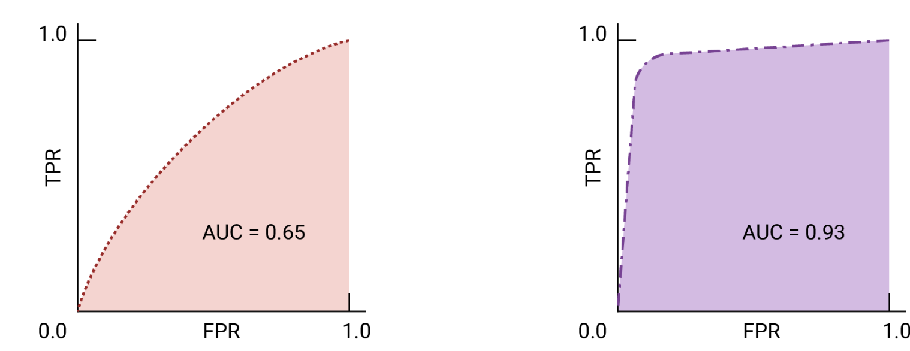

# Machine Learning Interview Notes

## 1. Introduction to Machine Learning

### 1.1 Supervised vs. Unsupervised Learning
- **Supervised Learning**: Learn from labeled data (inputs and corresponding outputs).
  - **Examples**: Logistic Regression, Support Vector Machines (SVM), boosting, bagging, Neural Networks.
  - **Common Tasks**: 
    - **Regression**: Predict continuous values (e.g., house prices).
    - **Classification**: Predict discrete labels (e.g., spam vs. not spam).
- **Unsupervised Learning**: Identify patterns in unlabeled data.
  - **Examples**: K-Means, PCA, DBSCAN.
  - **Common Tasks**: 
    - **Clustering**: Group similar data points (e.g., customer segmentation).
    - **Dimensionality Reduction**: Reduce data complexity while retaining important information (e.g., PCA).

### 1.2 Key Machine Learning Terms

#### Regression vs. Classification
- **Regression**: Predict continuous numerical values.
  - **Example**: Predicting stock prices.
  - **Equation**:  
    *y = β₀ + β₁x₁ + β₂x₂ + ... + βₙxₙ + ε*  
    where β are coefficients, x are features, and ε is the error term.
- **Classification**: Predict discrete categories (e.g., spam detection).

#### Overfitting vs. Underfitting
- **Overfitting**: Model learns noise and performs well on training data but poorly on validation data.
  - *Solution*: 
    - simplify the model: 
      - reduce width (e.g. number of parameters/neurons) 
      - reduce depth (e.g. num of layers for neural networks, depth for decision trees)
    - Data side:
      - increase data complexity/size
        - data augmentation
      - data standardization/normalization
    - Regularization: Add penalties to the model's complexity in the loss function
      -  L1 (Lasso): Adds a penalty proportional to the absolute value of coefficients.
         -  Loss_L1 = MSE + λ * Σ |β_i|
         -  Where:
            - MSE: Mean Squared Error.
            - λ: Regularization strength (controls the penalty amount).
            - β_i: Coefficients of the model.
      -  L2 (Ridge): Adds a penalty proportional to the square of coefficients.
         -  Loss_L2 = MSE + λ * Σ (β_i)^2
         -  Where:
            - MSE: Mean Squared Error.
            - λ: Regularization strength (controls the penalty amount).
            - β_i: Coefficients of the model.
    -  cross-validation: k-fold cross validation
    -  reduce feature complexity:
       -  feature selection
       -  reduce dimensionality: (e.g. PCA)
    -  pruning (for decision trees): Limit the depth of decision trees or set minimum samples required at each split
       -  cannot be applied in bagging or boosting
          -  bagging: use full unpruned decision trees, because it relies on high variance (complex trees)
          -  boosting: decision trees are typically shallow and unpruned
    -  dropout (for NNs): Randomly drop neurons during training to prevent co-dependency and reduce model complexity
    -  early stopping: Monitor the validation loss during training and stop when it begins to increase, which indicates overfitting.
    -  reduce learning rate
       -  makes small, gradual updates to the predictions in each iteration
       -  better at generalization, but longer time to converge
    -  ensemble methods: Combine multiple models to improve generalization
       -  bagging: Reduces variance by averaging predictions from multiple models.
       -  boosting: Sequentially reduces bias, high generalization power
- **Underfitting**: Model is too simple to capture patterns.
  - Increase model complexity
    - use non-linear model (e.g., neural networks, SVM with RBF kernel)
    - increase model depth and width
  - Add more features
  - Reduce regularization: 
    - reduce the value of λ in L1 and L2 penalty
  - increase training epochs
  - remove noise indata

##### [source: https://www.kaggle.com/code/ryanholbrook/overfitting-and-underfitting]

#### Bias-Variance Tradeoff
- **Bias**: The error introduced by approximating a real-world problem (which may be complex) with a simpler model.
  - High Bias:
    - Model is too simple (e.g., a linear model for a non-linear problem).
    - Fails to capture the underlying patterns in the data (underfitting).
    - Leads to high training and test error.
- **Variance**: The error introduced by the model’s sensitivity to small fluctuations in the training data.
  - High Variance:
    - Model is too complex (e.g., a deep decision tree with many splits).
    - Captures noise in the training data instead of the true underlying patterns (overfitting).
    - Leads to low training error but high test error.
- **Tradeoff**: Reducing bias increases variance, and reducing variance increases bias. The goal is to find a balance between the two to minimize the total error (sum of bias, variance, and irreducible error).

### 1.3 Common Evaluation Metrics
#### **Classification Metrics**
- **Accuracy**:
  - Measures the proportion of correctly classified instances.
   - Formula:  
     *Accuracy = (TP + TN) / (TP + TN + FP + FN)*
   - Best used when the dataset is balanced.

- **Precision**:  *Precision = TP / (TP + FP)*

- **Recall**:  *Recall = TP / (TP + FN)*

- **F1-Score**:  
  - The harmonic mean of precision and recall, balancing both.
  - *F1 = 2 * (Precision * Recall) / (Precision + Recall)*

- **Specificity (True Negative Rate)**:
   - Measures how well the model identifies negative cases.
   - Formula:  
     *Specificity = TN / (TN + FP)*

- **ROC-AUC (Receiver Operating Characteristic - Area Under Curve)**:  
  - Evaluates the trade-off between true positive rate (sensitivity) and false positive rate (1 - specificity).
   - AUC ranges from 0.5 (random guessing) to 1.0 (perfect classifier).
  - **True Positive Rate (TPR)**:  *TPR = TP / (TP + FN)*  
  - **False Positive Rate (FPR)**:  *FPR = FP / (FP + TN)*

[source: https://developers.google.com/machine-learning/crash-course/classification/roc-and-auc]

 

- **Logarithmic Loss (Log Loss)**:
   - Measures the uncertainty of predictions by assigning a penalty for being confident but wrong.
   - Formula:  
     *Log Loss = - (1 / N) * Σ [y_i * log(p_i) + (1 - y_i) * log(1 - p_i)]*

- **Matthews Correlation Coefficient (MCC)**:
   - A balanced metric that works well for imbalanced datasets.
   - Formula:  
     *MCC = (TP * TN - FP * FN) / sqrt((TP + FP) * (TP + FN) * (TN + FP) * (TN + FN))*

- **Cohen's Kappa**:
   - Measures the agreement between predicted and actual labels, accounting for chance.
   - Ranges from -1 (complete disagreement) to 1 (perfect agreement).

#### **Regression Metrics**
- **Mean Absolute Error (MAE)**:
   - Measures the average magnitude of errors without considering their direction.
   - Formula:  
     `MAE = (1 / N) * Σ |y_i - ŷ_i|`

- **Mean Squared Error (MSE)**:
   - Penalizes larger errors more heavily than MAE.
   - Formula:  
     `MSE = (1 / N) * Σ (y_i - ŷ_i)^2`

- **Root Mean Squared Error (RMSE)**:
   - The square root of MSE, making it interpretable in the same unit as the target variable.
   - Formula:  
     `RMSE = sqrt(MSE)`

- **R-squared (Coefficient of Determination)**:
   - Explains the proportion of variance in the target variable captured by the model.
   - Formula:  
     `R^2 = 1 - (Σ (y_i - ŷ_i)^2 / Σ (y_i - ȳ)^2)`

- **Mean Absolute Percentage Error (MAPE)**:
   - Measures the average percentage error between predicted and actual values.
   - Formula:  
     `MAPE = (1 / N) * Σ |(y_i - ŷ_i) / y_i| * 100`

#### **Clustering Metrics (Unsupervised Learning)**

- **Silhouette Score**:
   - Measures how similar a data point is to its own cluster compared to other clusters.
   - Ranges from -1 (poor clustering) to 1 (well-clustered).

- **Davies-Bouldin Index**:
   - Measures the ratio of within-cluster distances to between-cluster distances.
   - Lower values indicate better clustering.

- **Adjusted Rand Index (ARI)**:
   - Measures the similarity between the predicted clusters and the true clusters, adjusted for chance.

